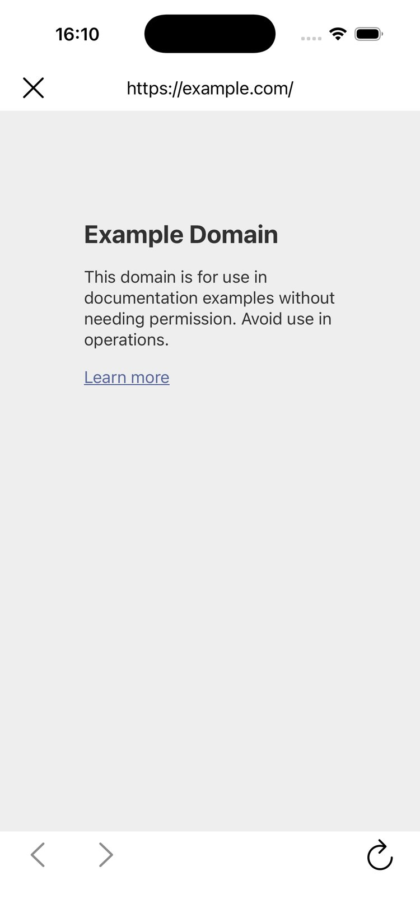
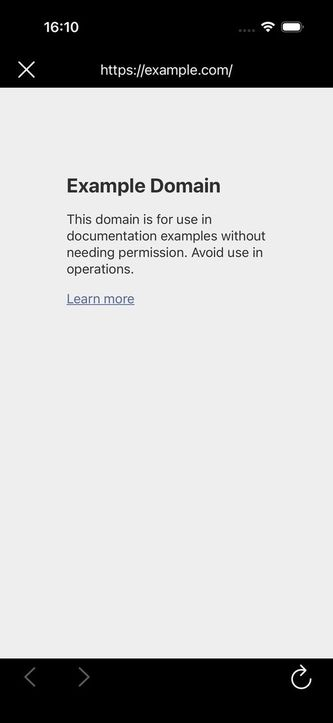
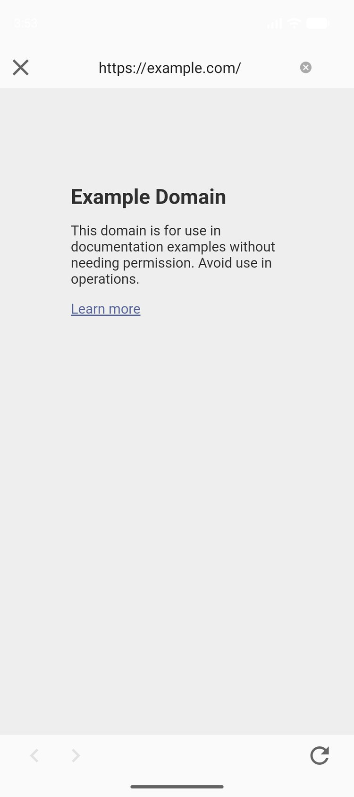
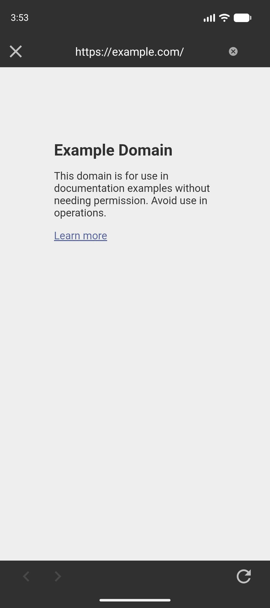

# simple_native_web_view_browser

Плагин для Flutter, который открывает страницы сайта в полноэкранном нативном браузере. Браузер работает одинаково на iOS и Android: у него есть верхняя панель с кнопкой закрытия и адресной строкой, нижняя панель с кнопками «Назад», «Вперёд» и «Обновить». Цвета панелей берутся из системной темы устройства, поэтому приложение корректно выглядит и в светлой, и в тёмной теме.

Репозиторий плагина: <https://github.com/npu3pak/flutter-simple-native-web-view-browser>

Плагин состоит из трёх частей:

- `simple_native_web_view_browser` — основная часть, с которой работает приложение;
- `simple_native_web_view_browser_ios` — реализация для iOS;
- `simple_native_web_view_browser_android` — реализация для Android.

Платформенные части подключаются автоматически, отдельно их добавлять не нужно.

## Оглавление

- [Требования](#требования)
- [Как подключить плагин](#как-подключить-плагин)
- [Как открыть браузер](#как-открыть-браузер)
- [Параметры запроса на открытие](#параметры-запроса-на-открытие)
- [Работа с куками](#работа-с-куками)
- [События](#события)
- [Скриншоты](#скриншоты)
- [Отладка WebView](#отладка-webview)
- [Известные особенности](#известные-особенности)
- [Повторное открытие браузера](#повторное-открытие-браузера)
- [Обработка пользовательских схем URI и использование для аутентификации](#обработка-пользовательских-схем-uri-и-использование-для-аутентификации)
- [Известные проблемы](#известные-проблемы)

## Требования

- Flutter версии 3.32 или новее;
- iOS 13.0 или новее;
- Android с минимальной версией SDK 26 (Android 8.0).

## Как подключить плагин

Плагин распространяется в виде git-репозитория. Чтобы подключить его, склонируйте репозиторий в проект и укажите зависимость в файле `pubspec.yaml`.

1. Склонируйте репозиторий плагина в подкаталог проекта, например `plugins/`:

   ```bash
   git clone https://github.com/npu3pak/flutter-simple-native-web-view-browser.git plugins/simple_native_web_view_browser
   ```

2. Добавьте зависимость в `pubspec.yaml`:

   ```yaml
   dependencies:
     simple_native_web_view_browser:
       path: plugins/simple_native_web_view_browser/simple_native_web_view_browser
   ```

   Путь должен указывать на основную часть плагина — на папку, внутри которой есть файл `pubspec.yaml` с именем пакета `simple_native_web_view_browser`. Если вы склонировали репозиторий в другой каталог, укажите свой путь к этой папке.

3. Выполните команду:

   ```bash
   flutter pub get
   ```

После этого плагин можно использовать в коде приложения.

## Как открыть браузер

Создайте объект `SimpleNativeBrowser` и вызовите метод `open`, передав ему параметры открытия — объект `SimpleBrowserOpenRequest`.

Минимальный пример:

```dart
import 'package:simple_native_web_view_browser/simple_native_web_view_browser.dart';

final browser = SimpleNativeBrowser();

await browser.open(
  SimpleBrowserOpenRequest(
    url: Uri.parse('https://example.com'),
  ),
);
```

Чтобы закрыть браузер из кода приложения, вызовите метод `close`:

```dart
await browser.close();
```

Браузер можно открывать несколько раз подряд. После каждого закрытия ресурсы освобождаются.

## Параметры запроса на открытие

Объект `SimpleBrowserOpenRequest` описывает, какую страницу открыть и как вести себя браузеру.

- **`url`** — адрес страницы, которую нужно открыть. Тип — `Uri`. Обязательный параметр, значения по умолчанию нет.

- **`userAgent`** — строка, которую браузер сообщает сайтам вместо стандартного описания браузера. Тип — `String?`. Необязательный параметр. Если не задан, используется стандартный пользовательский агент платформы.

- **`usePersistentCookieStore`** — нужно ли сохранять куки между запусками приложения. Тип — `bool`. Значение по умолчанию — `true`. При `true` куки остаются после закрытия браузера и перезапуска приложения; при `false` используется эфемерное хранилище, куки не сохраняются после закрытия браузера.

- **`initialCookies`** — куки, которые нужно установить до загрузки страницы. Тип — `List<SimpleBrowserCookie>`. Значение по умолчанию — пустой список.

- **`urlBarMode`** — режим адресной строки. Тип — `SimpleBrowserUrlBarMode`. Значение по умолчанию — `SimpleBrowserUrlBarMode.hidden`. Адресная строка находится на верхней панели и может работать в одном из трёх режимов:
  - `SimpleBrowserUrlBarMode.hidden` — адресная строка скрыта. Вместо неё показывается заголовок страницы;
  - `SimpleBrowserUrlBarMode.editable` — адресная строка видна. Пользователь может изменить адрес и перейти на новую страницу. Рядом со строкой появляется кнопка очистки, когда в ней есть текст;
  - `SimpleBrowserUrlBarMode.readOnly` — адресная строка видна, но изменить адрес нельзя. Она показывает текущий адрес страницы.

  Пример открытия браузера с адресной строкой, доступной для редактирования:

  ```dart
  await browser.open(
    SimpleBrowserOpenRequest(
      url: Uri.parse('https://example.com'),
      userAgent: myUserAgent,
      urlBarMode: SimpleBrowserUrlBarMode.editable,
    ),
  );
  ```

- **`onLoadStop`** — обработчик, который вызывается после завершения загрузки страницы. Тип — `void Function(Uri url)`. По умолчанию не задан. Обработчик получает адрес загруженной страницы.

- **`enableDebugging`** — включает режим отладки WebView: страницу браузера можно открыть в веб-инспекторе (Safari Web Inspector на Mac, Chrome DevTools на Android). Тип — `bool`. Значение по умолчанию — `false`. На iOS веб-инспектор доступен начиная с версии 16.4.

- **`reopenPolicy`** — функция, решающая, что делать при повторном открытии, когда браузер уже открыт: отбросить новый запрос, заменить только обработчики, применить настройки или полностью заменить сессию с перезагрузкой страницы. Тип — `SimpleBrowserReopenPolicy Function(SimpleBrowserOpenRequest oldRequest, SimpleBrowserOpenRequest newRequest)`. По умолчанию применяется полная замена.

- **`onLoadError`** — обработчик, который вызывается при ошибке загрузки. Тип — `void Function(Uri url)`. По умолчанию не задан. Обработчик получает адрес, на котором произошла ошибка.

- **`onSchemeRedirect`** — обработчик, который вызывается при попытке браузера открыть адрес с кастомной схемой (например, `myapp://...`): такой адрес не может быть загружен в WebView, поэтому плагин передаёт его приложению. Тип — `void Function(Uri url)`. По умолчанию не задан. Обработчик получает адрес с кастомной схемой.

- **`onClosed`** — обработчик, который вызывается после закрытия браузера любым способом: кнопкой закрытия, системной кнопкой «Назад» или методом `close`. Тип — `void Function()`. По умолчанию не задан.

## Работа с куками

### Куки, устанавливаемые до загрузки страницы

Если сайту нужны куки до открытия страницы, передайте их в параметре `initialCookies`. Куки будут установлены до того, как браузер начнёт загружать страницу.

```dart
final cookie = SimpleBrowserCookie(
  name: 'session',
  value: 'abc123',
  domain: 'example.com',
  path: '/',
  isSecure: true,
  isHttpOnly: true,
);

await browser.open(
  SimpleBrowserOpenRequest(
    url: Uri.parse('https://example.com'),
    userAgent: myUserAgent,
    initialCookies: [cookie],
  ),
);
```

Поля объекта `SimpleBrowserCookie`:

| Поле | Назначение |
|---|---|
| `name` | Имя куки. |
| `value` | Значение куки. |
| `domain` | Домен, для которого действует кука. Если не указан, берётся домен открываемой страницы. |
| `path` | Путь, для которого действует кука. По умолчанию `/`. |
| `isSecure` | Передавать куку только по защищённому соединению. |
| `isHttpOnly` | Скрыть куку от скриптов на странице. |

### Куки, устанавливаемые после загрузки страницы

Если куки нужно установить, когда страница уже открыта, используйте метод `reloadWithCookies`. Он устанавливает переданные куки и перезагружает текущую страницу.

```dart
await browser.reloadWithCookies([
  SimpleBrowserCookie(name: 'session', value: 'new_value', path: '/'),
]);
```

### Постоянное и эфемерное хранилище

Параметр `usePersistentCookieStore` определяет, что происходит с куками после закрытия браузера:

- `true` — куки сохраняются. После повторного открытия браузера или перезапуска приложения куки на месте. Это поведение по умолчанию.
- `false` — хранилище эфемерное. Куки не сохраняются после закрытия браузера.

Особенность Android: хранилище кук общее для всех браузеров приложения. Эфемерный режим очищает куки всех браузеров, поэтому при его использовании могут завершиться сеансы других экранов приложения с браузером.

## События

Плагин сообщает приложению о том, что происходит в браузере. Для этого в запрос на открытие передаются обработчики.

### Загрузка страницы завершена — `onLoadStop`

Обработчик получает адрес загруженной страницы:

```dart
onLoadStop: (url) {
  print('Страница загружена: $url');
},
```

### Ошибка загрузки — `onLoadError`

Обработчик получает адрес, на котором произошла ошибка:

```dart
onLoadError: (url) {
  print('Ошибка загрузки на адресе: $url');
},
```

### Кастомная схема — `onSchemeRedirect`

Если браузер пытается открыть адрес, который не может загрузить (например, адрес с собственной схемой приложения `myapp://login`), такой адрес передаётся приложению через обработчик `onSchemeRedirect`. Обычно это означает, что сайт возвращает приложению результат какого-то действия (например, завершение входа).

```dart
onSchemeRedirect: (url) {
  print('Перенаправление на кастомную схему: $url');
},
```

Адреса с кастомной схемой передаются только через `onSchemeRedirect` — в обработчик `onLoadError` они не попадают.

### Браузер закрыт — `onClosed`

Обработчик вызывается после закрытия браузера любым способом:

```dart
onClosed: () {
  print('Браузер закрыт');
},
```

## Скриншоты

Страница `https://example.com`, открытая в браузере плагина.

| Платформа | Светлая тема | Тёмная тема |
|---|---|---|
| iOS |  |  |
| Android |  |  |

## Отладка WebView

Режим отладки включает веб-инспектор: страницу браузера можно открыть в отладчике и смотреть консоль, сетевые запросы и состояние страницы.

### Как включить

Передайте в запрос на открытие параметр `enableDebugging: true`:

```dart
await browser.open(
  SimpleBrowserOpenRequest(
    url: Uri.parse('https://example.com'),
    userAgent: myUserAgent,
    enableDebugging: true,
  ),
);
```

На iOS веб-инспектор доступен начиная с версии 16.4. На Android режим отладки включается для всех WebView приложения — флаг задаётся глобально для процесса.

### Android: Chrome DevTools

1. Подключите устройство к компьютеру (с включённой USB-отладкой) или запустите эмулятор.
2. Откройте в Chrome на компьютере адрес `chrome://inspect`.
3. В списке устройств найдите нужное и нажмите «inspect» напротив WebView браузера.
4. Откроется DevTools: консоль, сеть, элементы страницы.

### iOS: Safari Web Inspector

1. На Mac включите меню «Разработка»: Safari → Настройки → Дополнения → «Показывать меню “Разработка”».
2. Запустите приложение на устройстве или симуляторе. Для устройства также включите «Веб-инспектор» в настройках Safari на устройстве (Настройки → Safari → Дополнения).
3. В меню «Разработка» выберите устройство и пункт со страницей браузера.
4. Откроется Web Inspector: консоль, сеть, элементы страницы.

## Повторное открытие браузера

Одновременно может быть открыт **только один** браузер. Если вызвать метод `open`, когда браузер уже открыт, новый браузер не создаётся: текущее вебвью остаётся на экране, а поведение определяет функция `reopenPolicy`. Функция получает активный (старый) и новый запросы и возвращает одно из действий:

- `SimpleBrowserReopenPolicy.discard` — новый запрос отбрасывается: страница, настройки и обработчики активного запроса сохраняются.
- `SimpleBrowserReopenPolicy.replaceCallbacks` — сессия заменяется: привязываются только обработчики нового запроса; страница и настройки остаются прежними.
- `SimpleBrowserReopenPolicy.replaceCallbacksAndSettings` — сессия заменяется: привязываются обработчики нового запроса и применяются его настройки — пользовательский агент, режим адресной строки, режим отладки; начальные куки устанавливаются в хранилище и вступят в силу при следующей загрузке страницы. Страница не перезагружается.
- `SimpleBrowserReopenPolicy.replaceCallbacksAndSettingsAndReload` — сессия заменяется полностью: привязываются обработчики нового запроса, применяются его настройки (как описано выше) и страница перезагружается на новый адрес.

Если `reopenPolicy` не задана, применяется полная замена (`replaceCallbacksAndSettingsAndReload`).

Пустое значение пользовательского агента возвращает стандартный агент платформы. Режим отладки на Android задаётся глобально для всего процесса — при замене сессии значение `enableDebugging` применяется ко всем WebView приложения.

При любом действии, кроме `discard`, обработчики старого запроса отвязываются: события (загрузка, ошибки, перенаправления, закрытие) начинают приходить новому запросу. Обработчик `onClosed` старого запроса не вызывается — при закрытии браузера сработает `onClosed` нового запроса.

### Пример

```dart
reopenPolicy: (oldRequest, newRequest) =>
    oldRequest.url == newRequest.url
        ? SimpleBrowserReopenPolicy.replaceCallbacks
        : SimpleBrowserReopenPolicy.replaceCallbacksAndSettingsAndReload,
```

Функция получает оба запроса — в ней можно выполнять собственные решения и уведомления (например, логировать повторные открытия).

## Обработка пользовательских схем URI и использование для аутентификации

Адреса с пользовательскими схемами (например, `myapp://...`) не могут быть загружены в WebView. Если браузер пытается перейти на такой адрес, плагин отменяет навигацию и передаёт адрес приложению через обработчик `onSchemeRedirect` (поле запроса на открытие): обработчик получает адрес, и приложение само решает, что с ним делать.

Пользовательские схемы часто используются как механизм возврата результата: страница перенаправляет браузер на адрес с собственной схемой, приложение перехватывает адрес и продолжает свою логику (например, завершает вход).

> [!WARNING]
> **Использование WebView для OAuth категорически не рекомендуется.** Встроенный браузер не предоставляет системных механизмов защиты от поддельных страниц и перехвата данных; доверять ему учётные данные опасно. Применяйте этот механизм только в крайних случаях, когда рекомендованные способы недоступны по техническим или иным причинам.
>
> Для потоков OAuth используйте рекомендованные механизмы платформ:
>
> - iOS: `ASWebAuthenticationSession` — веб-сессия аутентификации в системном браузере;
> - Android: Custom Tabs (`androidx.browser`) с системным браузером, например через библиотеку AppAuth (OAuth 2.0).

### Пример

Запуск страницы аутентификации и обработка возврата по пользовательской схеме:

```dart
final browser = SimpleNativeBrowser();
var redirectHandled = false;

const redirectPrefix = 'myapp://login';

void handleRedirect(Uri url) {
  if (redirectHandled) {
    return;
  }
  final urlString = url.toString();
  if (urlString.toLowerCase().startsWith(redirectPrefix.toLowerCase())) {
    redirectHandled = true;
    print('Аутентификация завершена: $urlString');
    browser.close();
  }
}

await browser.open(
  SimpleBrowserOpenRequest(
    url: Uri.parse('https://example.com/auth'),
    userAgent: myUserAgent,
    reopenPolicy: (oldRequest, newRequest) =>
        oldRequest.url == newRequest.url
            ? SimpleBrowserReopenPolicy.replaceCallbacks
            : SimpleBrowserReopenPolicy.replaceCallbacksAndSettingsAndReload,
    onLoadStop: handleRedirect,
    onLoadError: handleRedirect,
    onSchemeRedirect: handleRedirect,
    onClosed: () => print('Браузер закрыт'),
  ),
);
```

## Известные проблемы

### iOS: клавиши физической клавиатуры могут попадать в приложение

При тестировании обнаружено, что на iOS в определённых ситуациях нажатие Enter на физической клавиатуре (например, подключённой к устройству) передаётся не веб-странице, а Flutter-модулю. Обычно это происходит, когда фокус ввода находится не в полях веб-формы: событие клавиши активирует сфокусированный интерактивный элемент интерфейса Flutter (кнопку, поле) за окном браузера и запускает связанное с ним действие повторно.

Приложение должно быть к этому готово. Рекомендуемый способ — на время показа браузера блокировать собственные интерактивные виджеты: пока браузер открыт, элементы интерфейса приложения не должны реагировать на клавиатуру (например, снять с них фокус или отключить их), чтобы связанные с ними действия не запускались повторно.
